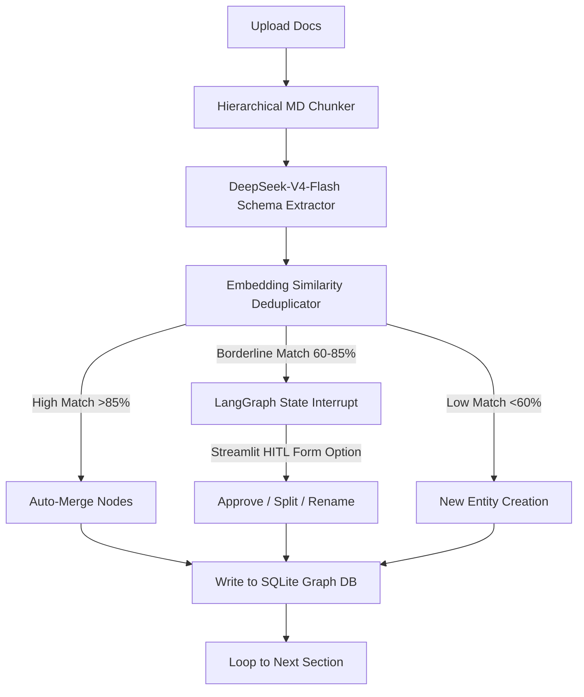
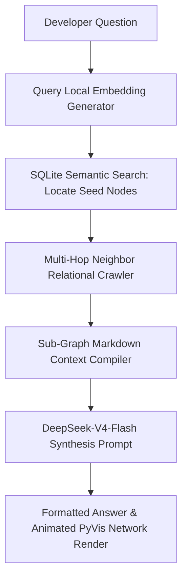

# 🕸️ AetherDocs: Self-Structuring Knowledge Graph Agent

AetherDocs is a portfolio-grade AI engineering application that transforms unstructured codebase documentation, API specifications, and architectural markdown files into a queryable, semantic **Knowledge Graph**. 

Powered by **LangGraph** for multi-step state machine flows, **DeepSeek-V4-Flash** for high-accuracy extraction, and a **custom SQLite Graph MCP Server**, AetherDocs implements an advanced **Hybrid Graph-RAG (Retrieval-Augmented Generation)** architecture. It solves the document fragmentation problem by linking technical concepts semantically and structurally, featuring an interactive **Human-in-the-Loop** duplicate merge approval dashboard.

---

## 🚀 Key Architectural Features

1. **Hierarchical Markdown Parser**: Reads files and chunks documentation along markdown header tokens (`#`, `##`, `###`), ensuring code blocks, tables, and lists remain syntactically unified and contextualized.
2. **DeepSeek Pydantic Extraction**: Utilizes strict Pydantic schemas bound to `deepseek-v4-flash` via `.with_structured_output()` to reliably extract technical components (Nodes) and architectural linkages (Edges).
3. **Entity Resolution (Deduplication)**: Computes semantic distance embeddings using local SentenceTransformers (`all-MiniLM-L6-v2`) to detect duplicate entities (e.g., `auth-api` vs. `Authentication Service`).
4. **Human-in-the-Loop Interrupts**: Implements LangGraph state checkpointer interrupts to freeze the ingestion pipeline on borderline conflicts (60% to 85% similarity), prompting the user via a web-card to approve, reject, or rename duplicate proposals before resuming database writes.
5. **Custom SQLite MCP Server**: Built using official `FastMCP` stdio transport, exposing schema-safe graph traversal tools that can connect to this agent or external AI editors (Cursor/Windsurf).
6. **Animated Graph Visualization**: Interactive Q&A chat page that generates and embeds zoomable, draggable 2D physics-based network diagrams (`pyvis`/D3) illustrating the exact sub-graph retrieved by the agent to answer the developer query.

---

## 📐 System Architecture

### Document Ingestion & Graph Builder


### Graph-RAG Query & Answer Synthesis


---

## 🛠️ Codebase Structure

```
aether_docs/
├── mcp_server/
│   ├── __init__.py
│   └── server.py          # SQLite Graph MCP Server (exposes graph database tooling)
├── agent/
│   ├── __init__.py
│   ├── state.py           # LangGraph TypedDict state declarations
│   ├── parser.py          # Hierarchical markdown structural chunking parser
│   ├── builder.py         # Stateful graph extraction & HITL merge pipeline
│   └── query.py           # Hybrid Graph-RAG search & answer synthesis pipeline
├── ui/
│   ├── __init__.py
│   └── app.py             # Streamlit premium glassmorphic dashboard
├── data/
│   └── graph.db           # Zero-setup SQLite relational graph database
├── test_mcp.py            # Integration test suite validating DB, vectors, and MCP tools
├── pyproject.toml         # Project metadata and dependencies (uv project configuration)
├── uv.lock                # UV lockfile ensuring exact package versions
└── README.md              # Project documentation
```

---

## 📦 Setup & Installation

### 1. Clone the Project
Create a local workspace directory and navigate to the project directory:
```bash
git clone <your-repository-url>
cd aether_docs
```

### 2. Synchronize Virtual Environment & Install Dependencies

Astral's `uv` automatically manages the virtual environment, installs all project dependencies, and resolves the lockfile in seconds:
```bash
# Automatically install and synchronize the environment
uv sync
```

---

## 💻 How to Run

### Run the Integration Tests
Before launching the UI, execute the verification suite to ensure SQLite database and embeddings are operational:
```bash
uv run test_mcp.py
```

### Start the Streamlit Application
Launch the graphical user interface:
```bash
uv run streamlit run ui/app.py
```

### Connect to the Custom MCP Server
To expose your graph database to external LLM clients or modern coding assistants:
```bash
uv run python mcp_server/server.py
```
*Note: FastMCP automatically sets up stdio routing. In your client configuration, set the command to `uv run python <absolute-path-to-server.py>`.*

---

## 💡 Engineering Design Choices
- **SQLite Relational Graph**: Relational tables (`nodes` and `edges`) in SQLite provide absolute portability. Recruiters can download the project and run it immediately without setting up Neo4j instances, docker containers, or cloud credentials.
- **In-Memory Cosine Similarity**: Computing vector cosine similarities in NumPy over binary blobs bypasses platform-compilation issues of tools like `sqlite-vec` on Windows, while operating instantly on technical documentation graphs.
- **Hierarchical Parsing over Sliding Windows**: Sliding window chunking cuts technical definitions in half. Splitting strictly by header tags maintains markdown integrity (unbroken tables and functional code snippets) for high-accuracy agent analysis.
